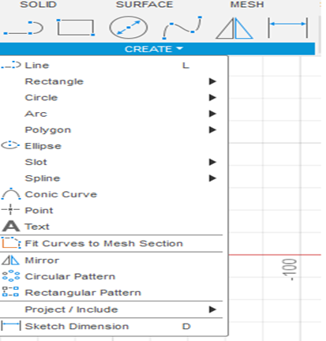
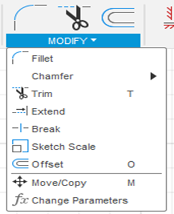
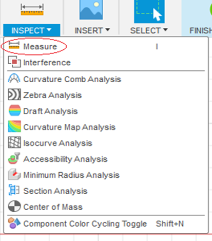
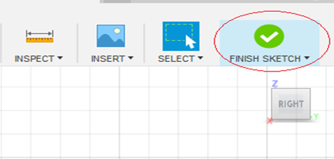
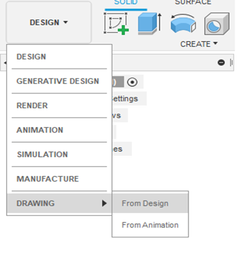
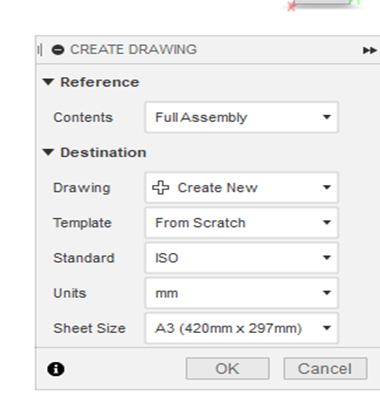
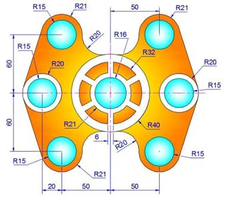
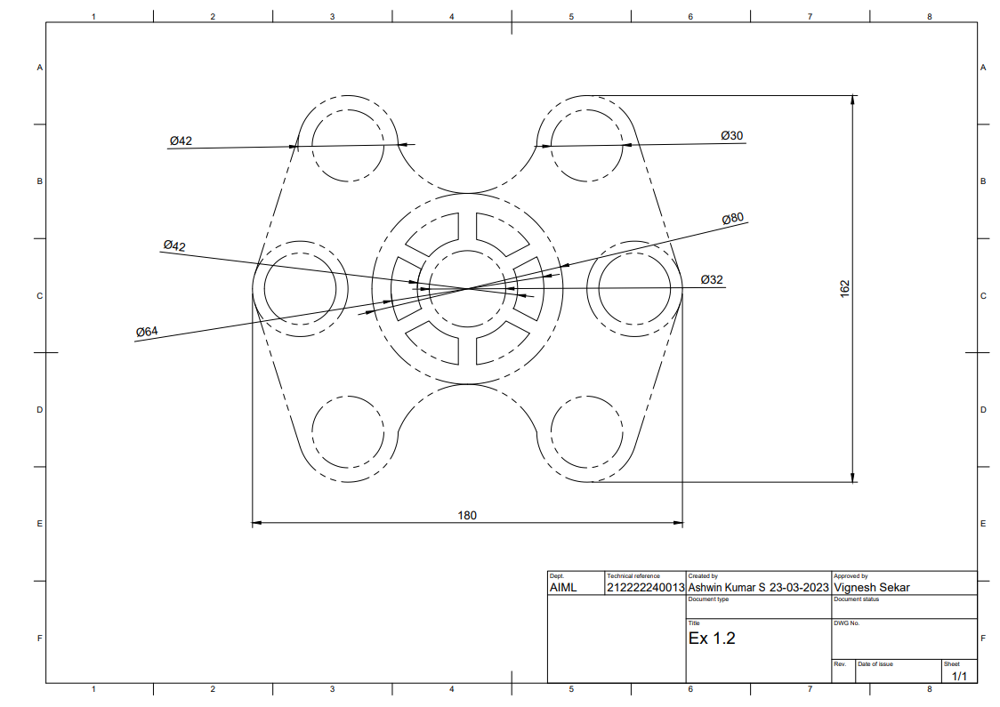

# Ex.No.-1.2-Design and Draft the given 2D Sketches in modelling software.

## AIM
 To sketch the given drawing with dimensions using fusion 360 tool.
 
## REQUIREMENTS
 1. Autodesk fusion 360
 2. Windows 10
 3. 16 GB of RAM (integrated graphics recommend 1 GB or more)
 4. 2.5 Mbps or faster download; 500 Kbps or faster upload 
 
 ## PROCEDURE
 1.	Open new file and then select sketch icon.
 2.	Select the plane for sketching. 
 3.	Use sketching features (line, circle, arc, rectangle, polygon, etc.,) to draw the given sketch.
 
 

 4.	Use sketch modifying features (cut, trim, mirror, move, etc.,) to edit the sketch.

 
 5.	Use inspect feature to measure the dimensions of sketch.
 
 
 
 6.	After finishing the sketch use finish sketch option to finalize the sketch.
 
 

 7.	After finishing the sketch switch to drawing mode to plot the sketch in ISO standard
 
 
 
 
 
 
 ## SKETCH

 

 ## OUTPUT
 

 
 ## RESULT
 Thus the given sketch is drawn and drafted using fusion 360 tool.
